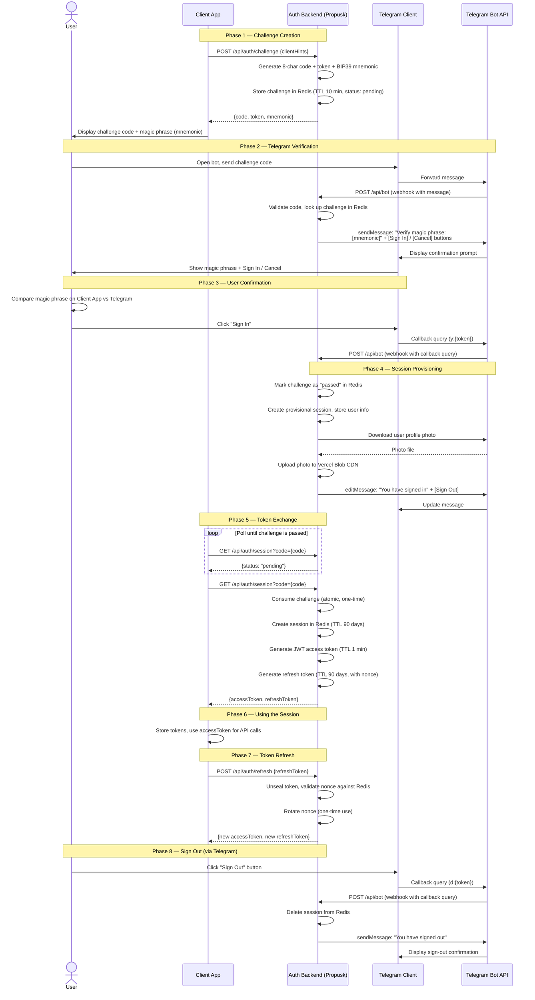

# Authentication Sequence Diagram

```mermaid
sequenceDiagram
    actor User
    participant Client as Client App
    participant Propusk as Auth Backend (Propusk)
    participant TG as Telegram Client
    participant TGBot as Telegram Bot API

    %% Phase 1: Challenge Creation
    Note over Client, Propusk: Phase 1 — Challenge Creation
    Client->>Propusk: POST /api/auth/challenge {clientHints}
    Propusk->>Propusk: Generate 8-char code + token + BIP39 mnemonic
    Propusk->>Propusk: Store challenge in Redis (TTL 10 min, status: pending)
    Propusk-->>Client: {code, token, mnemonic}
    Client->>User: Display challenge code + magic phrase (mnemonic)

    %% Phase 2: Telegram Verification
    Note over User, TGBot: Phase 2 — Telegram Verification
    User->>TG: Open bot, send challenge code
    TG->>TGBot: Forward message
    TGBot->>Propusk: POST /api/bot (webhook with message)
    Propusk->>Propusk: Validate code, look up challenge in Redis
    Propusk->>TGBot: sendMessage: "Verify magic phrase:<br/>[mnemonic]" + [Sign In] / [Cancel] buttons
    TGBot->>TG: Display confirmation prompt
    TG->>User: Show magic phrase + Sign In / Cancel

    %% Phase 3: User Confirms
    Note over User, TG: Phase 3 — User Confirmation
    User->>User: Compare magic phrase on Client App vs Telegram
    User->>TG: Click "Sign In"
    TG->>TGBot: Callback query (y:{token})
    TGBot->>Propusk: POST /api/bot (webhook with callback query)

    %% Phase 4: Session Creation
    Note over Propusk, TGBot: Phase 4 — Session Provisioning
    Propusk->>Propusk: Mark challenge as "passed" in Redis
    Propusk->>Propusk: Create provisional session, store user info
    Propusk->>TGBot: Download user profile photo
    TGBot-->>Propusk: Photo file
    Propusk->>Propusk: Upload photo to Vercel Blob CDN
    Propusk->>TGBot: editMessage: "You have signed in" + [Sign Out]
    TGBot->>TG: Update message

    %% Phase 5: Token Exchange
    Note over Client, Propusk: Phase 5 — Token Exchange
    loop Poll until challenge is passed
        Client->>Propusk: GET /api/auth/session?code={code}
        Propusk-->>Client: {status: "pending"}
    end
    Client->>Propusk: GET /api/auth/session?code={code}
    Propusk->>Propusk: Consume challenge (atomic, one-time)
    Propusk->>Propusk: Create session in Redis (TTL 90 days)
    Propusk->>Propusk: Generate JWT access token (TTL 1 min)
    Propusk->>Propusk: Generate refresh token (TTL 90 days, with nonce)
    Propusk-->>Client: {accessToken, refreshToken}

    %% Phase 6: Authenticated Requests
    Note over Client, Propusk: Phase 6 — Using the Session
    Client->>Client: Store tokens, use accessToken for API calls

    %% Phase 7: Token Refresh
    Note over Client, Propusk: Phase 7 — Token Refresh
    Client->>Propusk: POST /api/auth/refresh {refreshToken}
    Propusk->>Propusk: Unseal token, validate nonce against Redis
    Propusk->>Propusk: Rotate nonce (one-time use)
    Propusk-->>Client: {new accessToken, new refreshToken}

    %% Phase 8: Sign Out
    Note over User, Propusk: Phase 8 — Sign Out (via Telegram)
    User->>TG: Click "Sign Out" button
    TG->>TGBot: Callback query (d:{token})
    TGBot->>Propusk: POST /api/bot (webhook with callback query)
    Propusk->>Propusk: Delete session from Redis
    Propusk->>TGBot: sendMessage: "You have signed out"
    TGBot->>TG: Display sign-out confirmation
```
